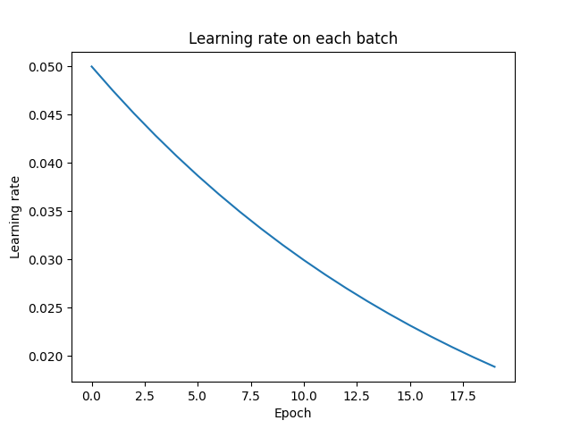

# NUMPY QUAZI TORCH

This library was created in order to design custom machine learning models by using numpy library.
The layers that are available are:

+  `ConvolutionLayer` - 2D convolutional layer
+  `Flatten` - layer for flattening tensors
+  `LinearLayer` - linear fully connected layer
+  `MaxPooling` - 2D max pooling layer
+  `RELU` - ReLU activation function
+  `Sigmoid` - sigmoid activation function
+  `SoftmaxLoss` - layer that is combining cross entropy and softmax

The new layers can be added by inheriting the base class `numpy_quazi_torch.models.Linear`. The base class requires the following methods:

+ `backpropragation(output_gradient, learning_rate)` - called after passing data through all layers
+ `update(learning_rate)` - called after calculating bacpropagation gradients
+ `__call__(input)` - pass input through layer
+ `get_weights()` - returns layers weights
+ `load_weights(list_of_weights)` - loads weights

In order to create a new architecture you can just define the mentioned layers in a order in which the input will be passed through. The class that passes input through initialized layers is called `numpy_quazi_torch.models.Model`. `Model` also backpropagates gradients through layers and store/loads weights.

There are three examples of architectures:

+ `numpy_quazi_torch.custom_models.MNIST_model_2` - which uses only linear and flattening layers in order to classify images from MNIST dataset
+ `numpy_quazi_torch.custom_models.MNIST_model_3` - that uses not only linear layers, but also CNN and MaxPool layers
+ `numpy_quazi_torch.custom_models.XOR` - architecture used for predicting XOR result on two input variables

The following pictures are describing `numpy_quazi_torch.custom_models.MNIST_model_2` performace.





> Metrics that are tracked are: **precision, recall and F1 score**.


Also, there is a class `numpy_quazi_torch.scheduler.ExponentialScheduler` that is reducing learning rate at every epoch (represents a scheduler):

$$lr_{i+1} = lr_{i} \cdot step^{i}, i \text{ - represents epoch index}$$

## Installation

To install this library, just download a git project and write: 

```
(working_python_enviroment)$ pip install .
```

In order to use trained `numpy_quazi_torch.custom_models.MNIST_model_2` model on a server (more in section *Server*) you need to extract `best.zip` file in the same directory where `server.py` script is.

## Training

In order to train the `numpy_quazi_torch.custom_models.MNIST_model_2` model there is a script `train` that can be called.

```
(working_python_enviroment)$ train -h

usage: train [-h] --epochs EPOCHS [--lr LR] --dataset DATASET [--train_size TRAIN_SIZE]
             [--batch_size BATCH_SIZE] [--store_plots] [--pretrained PRETRAINED]

Train model on MNIST dataset

options:
  -h, --help            show this help message and exit
  --epochs EPOCHS       Number of epochs
  --lr LR               Learning rate [0.01]
  --dataset DATASET     Path to train dataset
  --train_size TRAIN_SIZE
                        Train length [0.7]
  --batch_size BATCH_SIZE
                        Batch size
  --store_plots         Store plots
  --pretrained PRETRAINED
                        Path to pretrained weights
```

The output of a tran is saved in `runs` directory. Each training execution has its own ID which is given randomly. So, for example, if you need to find your latest training weights, you will look into `runs` directory and find the latest created dictionary in which you can see `weights` directory with all the layers weights.

## Server

There is also a streamlit server that can be started by the following command:

```
(working_python_enviroment)$ streamlit run server.py
```

Automatically, the GUI inside the web browser will be displayed.


There you can just upload a MNIST image and get the models'predition.